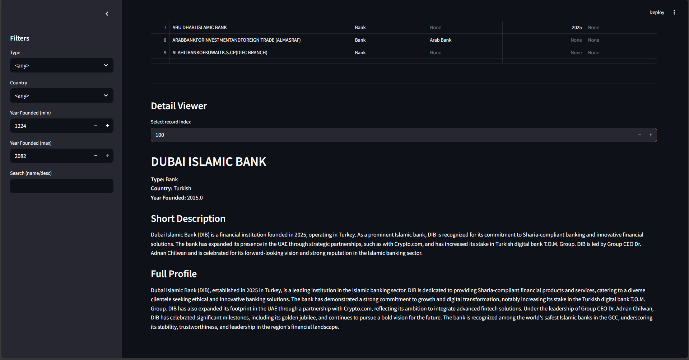

# Institution Profiles Explorer

> AI/NLP portfolio project · Python · Streamlit · Data analysis

An interactive application for exploring structured institution profiles. It loads normalized profile data, supports multi-criteria filtering and full-text search, and presents detailed records through a clean Streamlit interface.



## Highlights

- Interactive filtering by institution type, country, and founding year
- Full-text search across names, summaries, and long-form profiles
- Data normalization and analysis with pandas
- Evaluation metrics and CSV reporting
- Visual summaries and a browser-based Streamlit interface

## Tech stack

Python · Streamlit · pandas · NLP/data processing · CSV/JSON

## Run locally

```bash
python -m venv .venv
# Windows
.venv\Scripts\activate
# macOS/Linux
source .venv/bin/activate

pip install -r requirements.txt
streamlit run app.py
```

The application expects `profiles.json` in the repository root. Data-collection scripts may require separate API configuration; never commit private credentials.

## Project structure

- `app.py` — Streamlit application and interactive filters
- `data_collector.py` — profile data collection workflow
- `nlp.py` — text-processing logic
- `evaluate_profiles_metrics.py` — evaluation and reporting
- `metrics_summary.csv`, `stats_by_year.csv` — generated summaries
- `NLP.pdf` — project report

## What this demonstrates

Practical Python development, data pipelines, search/filter UX, evaluation, visualization, and communicating AI/NLP results through a usable product.

## Credits

Academic team project. Noura Manassra's portfolio copy preserves the original work and commit history.

## Portfolio context

This project supports my **Full-Stack + AI** focus: transforming data and language-processing workflows into an accessible application experience.
